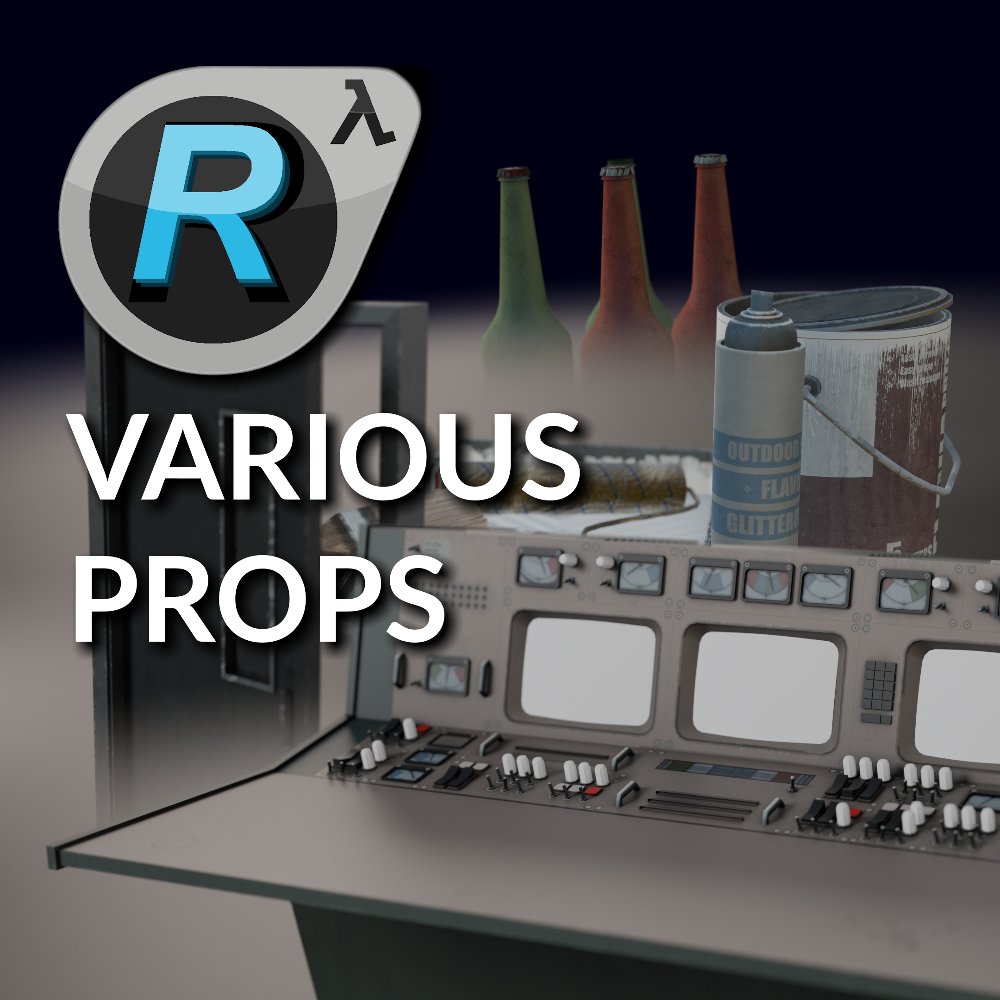

---

# Half-Life: Reflection

## Short info

Half-Life: Reflection is an in-development mod for Half-Life 2: Episode 2 based on mapbase. I've had (and have) the pleasure of working on this mod with its amazing team.

As we are a small team, I fullfilled many roles. One of which was the 3d-Artist.

---

Here are some of the 3d Assets I made in the last couple of months of working on the mod. The creation of these models was more complicated than it might first seem, as we had to recreate both the style and techniques used by Valve over 15 years ago to create models and textures that would fit closely within the universe of Half-Life.

I worked on both creating original models, as well as remastering existing models. All models have custom collision meshes and LODs.

### Original Models

**Console**

A prop used in the very beginning of the game. The screens are replaced in-engine with an interactable UI.

**Door**

Animated and interactable in-game.

**Painters Tools**

A set of painters tools to decorate the abandoned scaffholdings in City 17.

### Remasters

**Bottles**

We decided that the old bottle models in Half-Life 2 could use a refresh, which is why I went ahead and created a new bottle model with 4 variations - fully destructible.

**Container**

As we knew the player was going to be spending a lot of time near harbors and industrial yards, the old container model from 2004 was simply no longer going to cut it. Here you can see an in-engine comparison of the old 2004 model and my remastered version. I think it's quite apparent that we stuck to the same style but moved the technology forward a bit.

****
